# ChatGPT Plus 国内订阅与 Codex 使用避坑指南（2026.7）

## 看完本文你可以获得什么

只要具备稳定的海外代理，跟着本文一步步操作，100%可以掌握注册、订阅并长期稳定使用 ChatGPT Plus的方法，规避所有楼主踩过的坑。

---

## 一、先确定自己的需求

这篇教程不需要从头读到尾。先回答第一个问题：**你能接受使用第三方中转站吗？**

- 能接受：可以直接看[楼主自用中转](#九楼主自用中转)。
- 不能接受：继续回答下面的第二个问题，确定自己需要 ChatGPT Work 还是 Codex。

1. 只需要使用 ChatGPT 或 ChatGPT Work：主要进行对话、调研、文档、表格或网页任务。
2. 刚需 Codex：需要让 AI 参与代码开发，修改项目文件、运行测试或处理 Git。

> 如果你是新手，不知道怎么判断，可以简单理解为：**非程序员优先用 Work，程序员优先用 Codex。**
>
> 以上只是方便入门的参考标准。如果你是深度用户，请根据自己的实际需求自行判断。
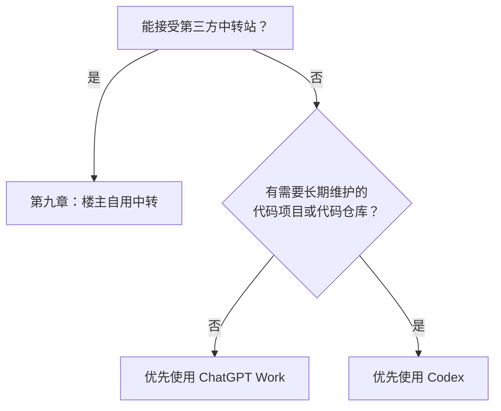

ChatGPT Work 和 Codex 的注册、订阅与使用流程基本一致，但 Codex 最好额外准备一个能长期接收短信验证码的海外手机号；如果没有，后文也会介绍替代方案。

---

## 二、章节跳转目录

根据自己的需求，可以直接跳到对应章节：

| 你的需求 | 对应章节 |
|---|---|
| 注册海外邮箱 | [第三章：注册 Gmail](#三注册-gmail) |
| 注册 ChatGPT 账号 | [第四章：注册 ChatGPT 账号](#四注册-chatgpt-账号) |
| 注册美区 Apple ID | [第五章：注册美区 Apple ID](#五注册美区-apple-id) |
| 通过美区 Apple ID 订阅 Plus | [第六章：通过美区 Apple ID 为 ChatGPT 添加订阅](#六通过美区-apple-id-为-chatgpt-添加订阅) |
| Codex 手机号验证与接码 | [第七章：Codex 短信接码](#七codex-短信接码) |
| 使用 CC Switch 切换 Codex 登录状态 | [第八章：使用 CC Switch 切换登录状态，避免反复退出登录](#八使用-cc-switch-切换登录状态避免反复退出登录) |
| 使用楼主自用中转 | [第九章：楼主自用中转](#九楼主自用中转) |
| 比较中转和 Plus 的性价比 | [第十章：中转和 Plus 的性价比对比](#十中转和-plus-的性价比对比) |

---

## 三、注册 Gmail

本章只适用于还没有可长期使用的海外邮箱的用户。已有海外邮箱，或已经有 ChatGPT 账号的用户，可以跳过本章。

Gmail 主要用于注册 ChatGPT 账号；如果你已经有其他可长期使用的海外邮箱，不必重复注册 Gmail。

### 准备什么

- 一个稳定的海外代理环境，确保可以访问 Google 并完成 Gmail 注册。

### 注册 Gmail

1. 打开 [Google 账号注册页面](https://accounts.google.com/signup)。
2. 按页面提示逐步填写信息并完成注册即可。

楼主实测，中国大陆 `+86` 手机号可以完成 Google 页面要求的短信验证。

<p align="center">
  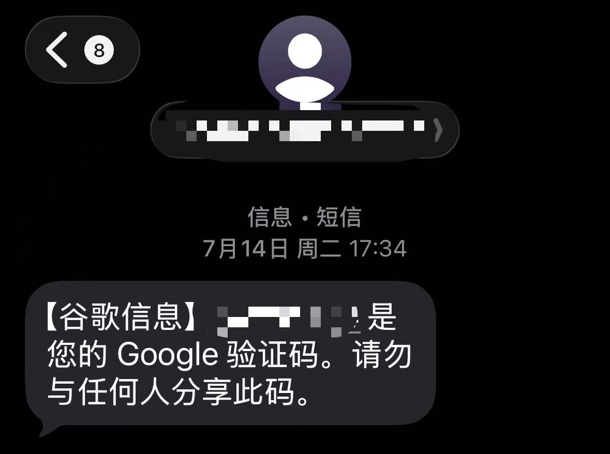
</p>

注册还是蛮简单的，没有海外邮箱的话就自己注册个吧～

---

## 四、注册 ChatGPT 账号

本章只适用于还没有 ChatGPT 账号的用户。已有 ChatGPT 账号的用户，可以直接跳到[第五章：注册美区 Apple ID](#五注册美区-apple-id)。

### 注册 ChatGPT

1. 打开 [ChatGPT 登录与注册页面](https://chatgpt.com/auth/login)。
2. 选择 **Continue with Google / 使用 Google 继续**。

<p align="center">
  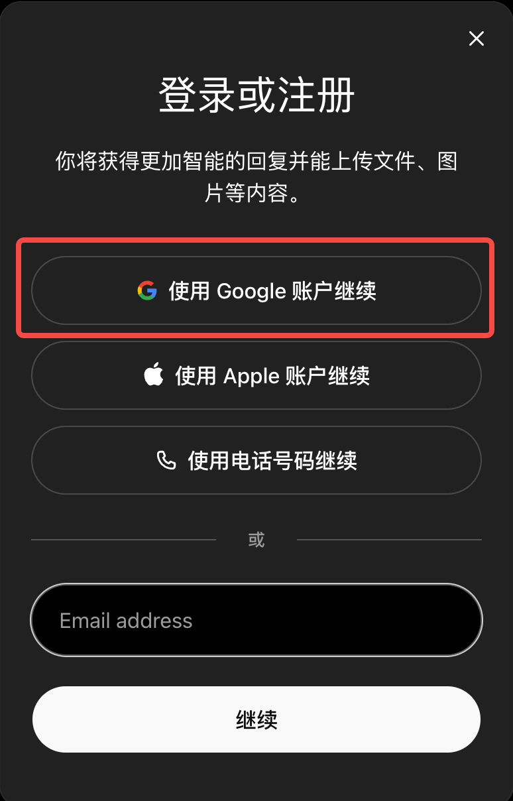
</p>

3. 选择准备使用的 Gmail账号即可。

<p align="center">
  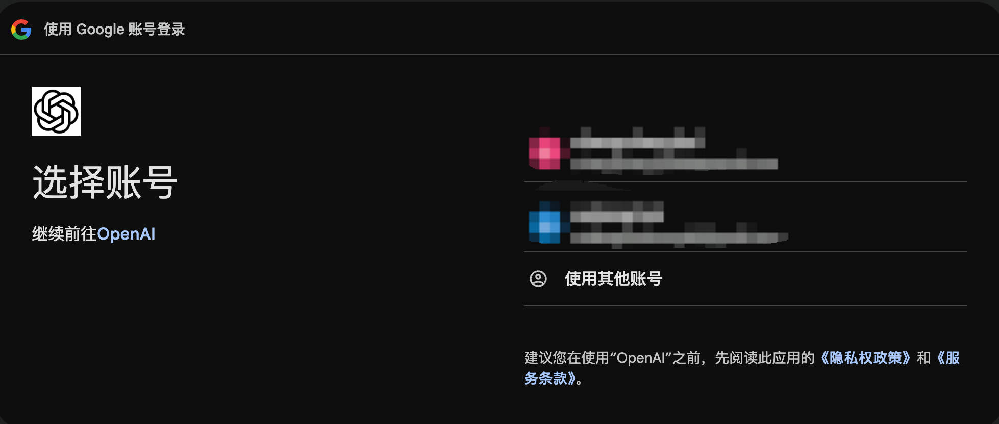
</p>

以后登录 ChatGPT、Codex 桌面端、CLI 或 IDE 扩展时，都继续使用相同的登录方式和 Gmail，否则可能进入另一个没有订阅和历史记录的账号。

### 注册需要海外手机号吗？

不需要，新建 OpenAI 账号和普通 ChatGPT 不要求手机号验证。

---

## 五、注册美区 Apple ID

> [!CAUTION]
> Codex 用户付款前必读：如果你准备使用 Codex，请先阅读[第七章：Codex 短信接码](#七codex-短信接码)，确认自己能够接受手机号验证相关风险后再付款。

如果有海外信用卡，可以直接在 ChatGPT 网页端订阅，无需准备美区 Apple ID，还可以享受一个月免费试用。

本章只适用于没有海外信用卡、还没有美区 Apple ID，并准备通过 iOS 内购订阅 Plus 的用户。已有美区 Apple ID 的用户，可以直接跳到[第六章：通过美区 Apple ID 为 ChatGPT 添加订阅](#六通过美区-apple-id-为-chatgpt-添加订阅)。

### 注册美区 Apple ID

楼主注册时参考了这篇[美区 Apple ID 图文教程](https://zhuanlan.zhihu.com/p/1894384007493433126)。跟着教程来即可。

### 购买美区 Apple Gift Card

楼主优先通过支付宝购买美区 Apple Gift Card。

支付宝首页左上角地区选择**旧金山**，然后点击**礼品卡**；跳转后，首屏即可看到 Apple 礼卡入口。

1. 地区选择旧金山，点击“礼品卡”。
2. 跳转后选择 Apple 礼卡。

<p align="center">
  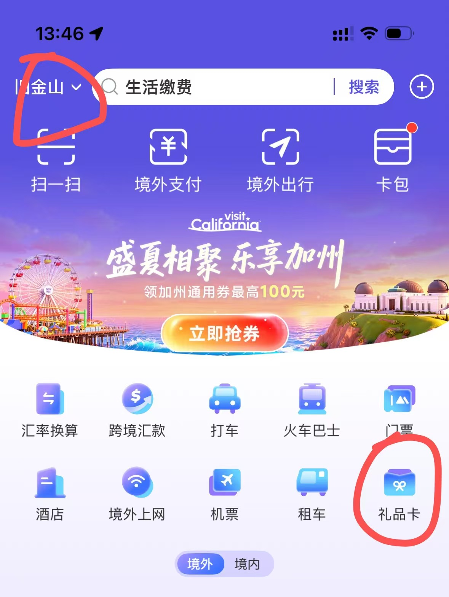
  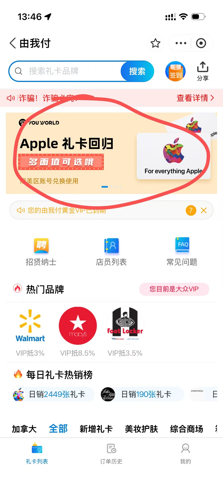
</p>

> [!WARNING]
> 坑点：每月月初约前 5～7 天，支付宝可能显示“正在补货”，此时只能等待补货；急用时可以考虑闲鱼。

---

## 六、通过美区 Apple ID 为 ChatGPT 添加订阅

> [!CAUTION]
> Codex 用户付款前必读：如果你准备使用 Codex，请先阅读[第七章：Codex 短信接码](#七codex-短信接码)，确认自己能够接受手机号验证相关风险后再付款。

本章介绍如何使用美区 Apple ID 通过 iOS 为 ChatGPT 添加 Plus 订阅。

### 付款前必须确认

1. 使用美区 Apple ID 登录 App Store，下载 OpenAI 官方 ChatGPT App。
2. ChatGPT App 登录的是准备长期使用的目标 ChatGPT 账号。
3. App Store“媒体与购买项目”登录的是准备扣款的目标 Apple ID。

> [!CAUTION]
> 坑点：Apple ID 一旦成功为某个 ChatGPT 账号付款，二者就会永久绑定，目前没有任何解绑方式。付款前请务必确认：这个 Apple ID 之前没有为其他 ChatGPT 账号充值过；当前 ChatGPT 账号也没有被其他 Apple ID 充值过。这是楼主的血泪教训，详见后面的[楼主心路历程](#楼主心路历程)。

### 订阅步骤

1. 打开已下载的 OpenAI 官方 ChatGPT App。
2. 登录目标 ChatGPT 账号，再次核对邮箱和登录方式。
3. 打开套餐升级入口，选择 ChatGPT Plus。
5. 通过 Apple 内购确认付款。
6. 付款后确认当前 ChatGPT 账号已经显示 Plus。


### Apple 余额无法完成购买

> [!WARNING]
> 付款时如果出现 `Your Purchase Could Not Be Completed`，通常说明 Apple Account 触发了购买风控，新注册的账号更容易遇到。不过别急，这个问题可以100%稳定解决：

楼主当时参考了这篇[购买失败处理教程](https://zhuanlan.zhihu.com/p/1987246308558403449)，通过 Apple 支持的“无法完成购买”入口联系人工客服核查购买权限。

### 订阅绑错账号怎么办

> [!CAUTION]
> 坑点：iOS 订阅会绑定付款时的 Apple ID 和 ChatGPT 账号，目前不能换绑或转移，注销账号、重装 App 也无法解除。付款前确认：这个 Apple ID 没有为其他 ChatGPT 账号付款过，当前 ChatGPT 账号也没有被其他 Apple ID 购买过。楼主曾踩过此坑，详见[楼主心路历程](#楼主心路历程)。

#### 楼主心路历程

- 7 月 5 日下午：通过 iOS 开通 Plus。
- 7 月 7 日：codex登陆触发二次验证，申请退款，首次申请获批，20 美元退回 Apple 余额。
- 随后使用同一Apple 账号在新 ChatGPT 账号里再次购买，但订阅仍关联到已经注销的旧账号。
- 7 月 14 日：第二次申请退款，被判定为不符合退款条件。
- 7 月 16 日：复核后仍被拒绝，页面显示为最终结果。
- 7 月 17 日：Apple 在线客服表示普通顾问无法继续操作，只能尝试拨打美区支持电话 `1-800-275-2273` 联系高级团队，且不能保证退款；邮件也不能替代这一步。

> [!CAUTION]
> 坑点：第二次退款很可能失败，请谨慎使用 Apple 退款申请，你的退款机会可能只有一次。申诉只能拨打美区支持电话联系高级团队，实操难度太大。

楼主的Apple退款申请记录，可以看到 7 月 7 日的首次退款获批，7 月 14 日、16 日的后续申请被拒。

<p align="center">
  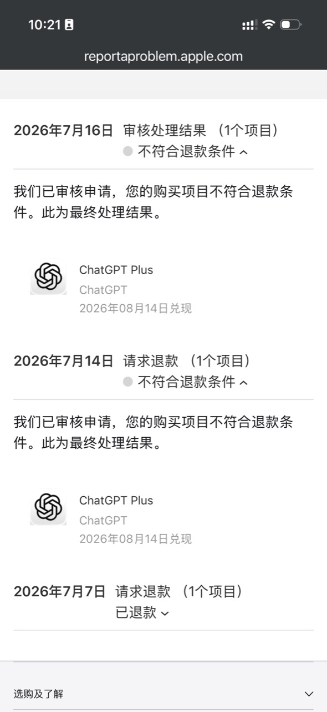
</p>

<p align="center"><em>Apple 退款处理记录</em></p>

下面两张图是楼主与 Apple 客服沟通退款问题的实际记录：

<p align="center">
  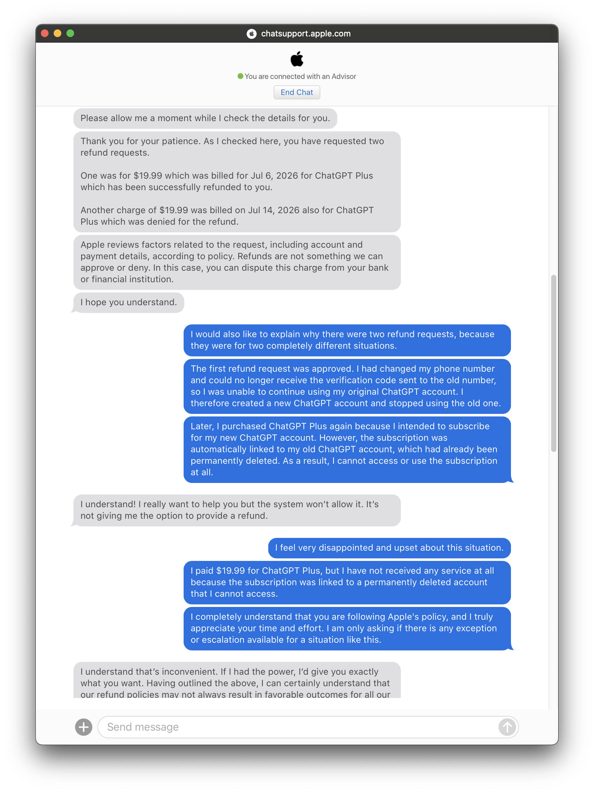
  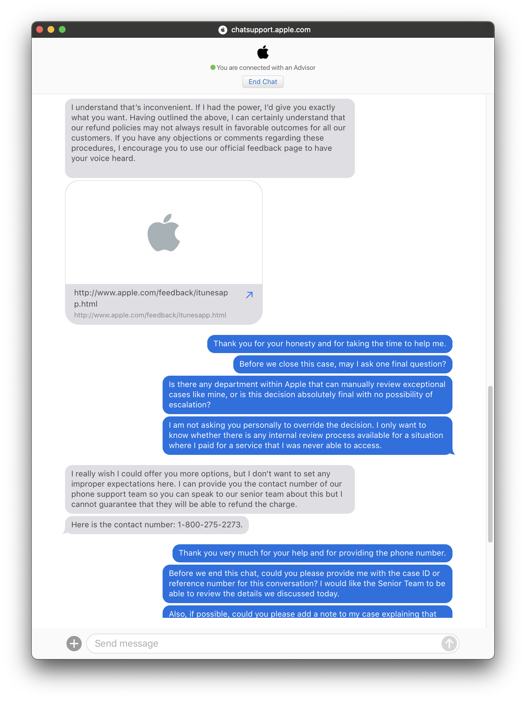
</p>

<p align="center"><em>Apple 客服沟通记录</em></p>

---

## 七、Codex 短信接码

> [!IMPORTANT]
> 刚需 Codex 的用户请重点阅读本章。如果你只使用网页/移动端 ChatGPT 或 ChatGPT Work，不需要桌面端 Codex，可以跳过。

> [!CAUTION]
> 重中之重：首次绑定的手机号必须长期保留。桌面端 Codex 首次登录需要绑定手机号，绑定后无法换绑；后续登录可能触发二次验证，并向第一次绑定的手机号发送短信验证码。目前二次验证没有任何跳过方式：一旦触发二次验证，而你又无法接收短信验证码，就无法登录桌面端 Codex。此时只能选择：1. 向OpenAI申诉 2. 寄希望于封控策略放宽 3. 注销账号，等待邮箱一个月后解除占用，再重新注册账号并绑定新的手机号。

### Codex 登录流程

1. 在桌面端 Codex 中选择使用 ChatGPT 账号登录。
2. Codex 会跳转到网页端登录页面，继续选择 **Continue with Google / 使用 Google 继续**。
3. 选择前面注册 ChatGPT 时使用的 Gmail 账号。
4. 首次登录时，按页面提示绑定手机号并完成短信验证。

如果你能接受以后可能触发二次验证、临时号码无法找回的风险，也可以通过临时接码网站完成首次验证。楼主使用的是 [Hero SMS](https://hero-sms.com/cn)：首次需要充值约 2 美元，每次接码成本约 0.5 元人民币；选个热门地区号码即可。

### 二次验证与申诉

2026 年 7 月 14 日，楼主就触发二次验证、无法接收验证码登录桌面端 Codex 的问题向 OpenAI 客服提交申诉。

<p align="center">
  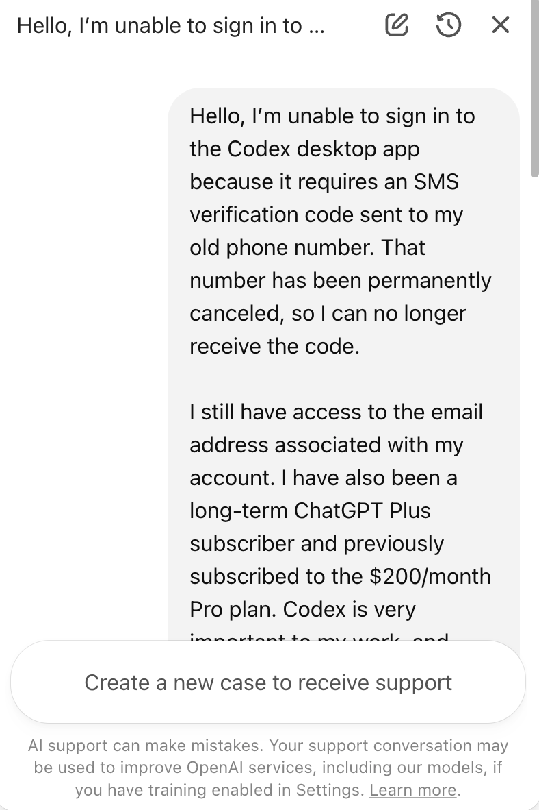
</p>

<p align="center"><em>7 月 14 日：向 OpenAI 客服提交申诉</em></p>

7 月 18 日，OpenAI 客服回复：目前不支持更改、更新或替换账号关联的手机号，客服也无法手动修改手机号验证记录；如需使用其他手机号，只能创建新账号。

<p align="center">
  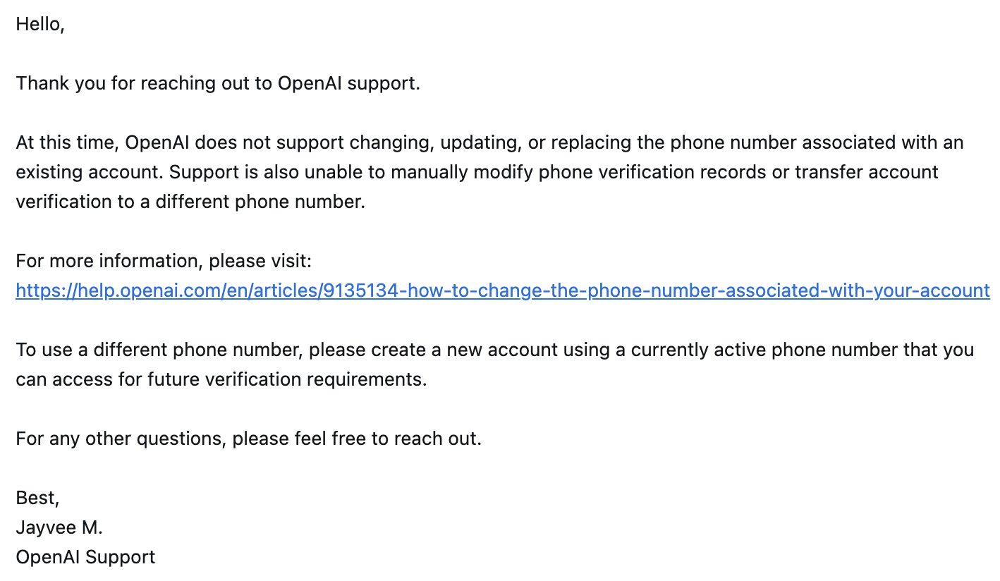
</p>

<p align="center"><em>7 月 18 日：OpenAI 客服回复</em></p>

同日，楼主再次尝试登录 Codex ，神奇的发现不需要二次验证了，可以正常进入。目前无法确认是申诉生效、账号风控解除，还是整体验证策略有所放宽。

### 原手机号已经失效怎么办

如果页面没有提供其他验证方式，就无法直接跳过，只能尝试向 OpenAI 申诉。无法保证一定能解除验证。

1. 通过 [OpenAI Help Center](https://help.openai.com/) 右下角聊天入口联系支持。
2. 与英文客服沟通时，可以使用 ChatGPT 极速模式翻译对方回复并生成英文答复。

### 临时接码为什么不适合长期账号

临时号码有效时间是20分钟，后续无法找回，以后再次要求向原号码发送验证码时，无法接收验证码。

---

## 八、使用 CC Switch 切换登录状态，避免反复退出登录

如果需要频繁切换账号，建议使用 [CC Switch](https://github.com/farion1231/cc-switch) 切换登录状态，避免因反复退出和重新登录而触发二次验证。

> [!WARNING]
> 坑点：建议每天通过 CC Switch 切换并登录一次Codex。长时间不登录，保存的登录状态可能失效，之后仍需重新登录，并可能触发二次验证。

---

## 九、楼主自用中转

楼主想通过官方订阅长期使用 Codex，最大的困难不是订阅本身，而是没有一个能长期接收短信验证码的海外手机号。Codex 首次登录绑定手机号后无法换绑，后续又可能触发二次验证，长期使用始终存在不稳定风险。折腾一圈后，楼主目前也转战中转站了。这篇教程主要是把自己的心路历程和踩坑经验记录下来，分享给有订阅需求的朋友，帮大家少走一些弯路。

目前楼主自用的是 [zz-api.cc.cd](https://ww.zz-api.cc.cd/register?aff=TGTMUXRZFVTR)，`0.05`元rmb可以购买 `1 美元`的官方 API 等值用量，支持 `image2` 生图。楼主还专门计算了它和官方 Plus 的性价比[第十章：中转和 Plus 的性价比对比](#十中转和-plus-的性价比对比)，对比下来还是挺香的。

如果你准备试用下楼主使用的中转，可以通过[楼主的邀请链接](https://ww.zz-api.cc.cd/register?aff=TGTMUXRZFVTR)注册。通过该链接注册后，楼主可以获得 `10%` 的返利，就当支持楼主了hhhh；你也可以分享给你的朋友来获得10%的返利。

### 使用记录

#### 2026 年 7 月 22 日

昨晚用 `0.08` 倍率线路跑了一宿任务，跑了将近 5 亿token，花了楼主 30 多块钱。早上起来才发现，昨晚降价了，有`0.03`倍率可用，血亏20多😭😭😭，赶紧切过去了。目前 `0.03` 倍率线路使用稳定，继续观察一下。

<p align="center">
  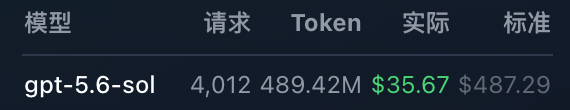
</p>

#### 2026 年 7 月 21 日

今天`0.05` 倍率线路不稳定，楼主使用时出断联；切换到 `0.08` 倍率线路后恢复正常，后续再观察一下。

---

## 十、中转和 Plus 的性价比对比

ChatGPT Plus 通常约 **140 元人民币/月**。

Plus 的周额度按 **150 美元 API 等值用量**估算，正常一个月按 4.5 倍周额度计算。根据 [Codex Resets](https://codex-resets.com/) 的记录，2026 年 7 月截至目前已经额外重置了 8 次，因此这个月总共可以按 **12.5 倍周额度**计算：

```text
12.5 × 150 美元
= 1,875 美元 API 等值用量
```

<p align="center">
  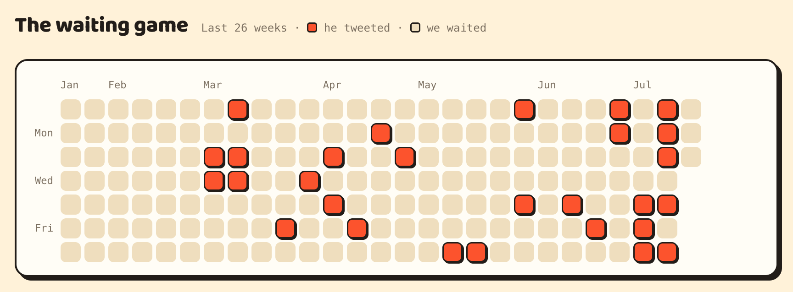
</p>

<p align="center"><em>Codex Resets 记录的额度重置情况</em></p>

楼主目前使用的中转价格是 **0.05 元人民币购买 1 美元官方 API 等值用量**。同样的 1,875 美元用量，通过中转只需要：

```text
1,875 × 0.05 元
= 93.75 元
```

也就是说，即使 7 月的额度重置次数已经远超平时，140 元的 Plus 在纯 Token 用量性价比上仍然打不过中转。中转也不要求你在短时间内把额度用满，用多少充多少，确实有点香。楼主也很无奈，最后只能加入了。

---

## 项目说明

写下这篇教程的初衷，只是记录楼主一路踩过的坑，希望后来者能少走一些弯路，仅此而已～也欢迎大家提交 Issue 或 Pull Request，一起补充和完善。

如果这篇教程对你有帮助，也希望大家可以顺手点个 Star 支持一下，感谢～
