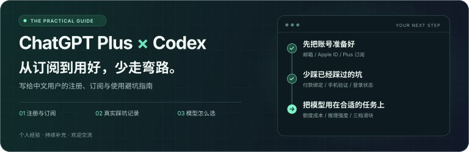

  

<h1 align="center">ChatGPT Plus 国内订阅与 Codex 使用避坑指南</h1>

从开通 Plus 到选好模型，把楼主踩过的坑和实际使用经验整理给你。

  
  
  

  <a href="#subscribe"><strong>开通 Plus</strong></a> ·
  <a href="#before-paying"><strong>付款前看避坑</strong></a> ·
  <a href="#models"><strong>选择模型</strong></a> ·
  <a href="#start"><strong>阅读路线</strong></a>

| 准备注册与订阅 | 已经开始用 Codex | 想把常用操作变简单 |
| :--- | :--- | :--- |
| 邮箱、Apple ID、礼品卡与 Plus 订阅，把步骤串起来 | 手机验证、额度成本、模型与推理强度，结合实际经验选择 | 用开源三档滑块，一次选好模型与推理强度 |
| [从付款前检查开始 →](#before-paying) | [看看模型怎么选 →](#models) | [查看滑块工具（中文）→](https://github.com/cabbagecabbage/codex-model-slider/blob/main/README.zh-CN.md) |

**觉得有帮助，欢迎点个 Star ⭐ 支持一下！** 有新经验或发现内容需要更新，也欢迎[提 Issue](https://github.com/cabbagecabbage/chatgpt-plus-codex-cn-guide/issues)，一起把这份指南补充得更好。

写在前面：这份指南从哪里来？

楼主把自己在注册、订阅和使用中的经历整理在这里，希望帮后来者少走弯路。操作步骤放在正文，退款、申诉截图和长期使用记录留在展开内容及附录里，大家按需阅读即可。

这是个人经验整理，非官方指南。各项经历标注了时间；遇到页面或账号要求变化时，也欢迎提 Issue 补充。

---

## 从哪里开始看？

| 你现在的情况 | 建议阅读路线 |
|---|---|
| 还没订阅，准备开始 | [付款前检查](#before-paying) → [准备账号](#accounts) → [开通 Plus](#subscribe) |
| 已有账号和美区 Apple ID，只差付款 | [付款前检查](#before-paying) → [礼品卡与订阅](#subscribe) |
| 已经订阅，准备使用 Codex | [Codex 登录与验证](#codex) |
| 已经在用，想选好模型 | [模型与推理强度](#models) → [三档滑块工具](#slider) |
| 额度不够，想了解备选方案 | [中转与成本比较](#relay) |
| 想看楼主的经历和截图 | [退款记录](#楼主心路历程)、[手机验证申诉](#phone-record)、[历史使用记录](#history) |

如果主要用 ChatGPT 做对话、调研或文档，可以先看注册订阅部分；准备让 Codex 修改代码、运行测试或处理 Git，则继续看登录与选模部分。已有的账号和准备步骤都可以跳过。

## 付款前，先确认这三件事

- **确认要使用的 ChatGPT 账号。** 登录后核对账号邮箱，后面注册、付款和登录 Codex 都围绕这个账号进行。
- **确认负责付款的 Apple ID。** 楼主曾遇到换了 ChatGPT 账号后，付款仍关联旧账号的情况。尤其是曾给其他账号买过订阅的 Apple ID，先核对订阅归属，不要急着重复付款。
- **如果主要为了用 Codex，先尝试登录。** 楼主在 2026 年 7 月遇到过手机号验证和后续二次验证；先了解自己的账号是否出现验证要求、能否长期接收验证码，再决定付款。具体经历见[登录与验证](#codex)。

还没有账号的话，先按下一节准备，付款前再回来核对这三项。订阅绑错、重复付款等问题的处理记录放在[订阅常见问题](#subscription-help)。

## 准备邮箱和 ChatGPT 账号

### 已有账号可以跳过

已有可使用的 ChatGPT 账号，直接去[开通 Plus](#subscribe)。没有账号的话，先准备一个自己能长期使用的邮箱；楼主采用的是 Gmail 加 Google 登录的方式。

### 准备 Gmail

已有 Gmail 可以跳过。需要新建时，在能够访问 Google 的网络环境下打开 [Google 账号注册页面](https://accounts.google.com/signup)，按页面提示注册。楼主当时用中国大陆 `+86` 手机号完成了页面要求的短信验证。

查看楼主注册时的手机验证截图

  

### 注册并确认 ChatGPT 账号

1. 打开 [ChatGPT 登录与注册页面](https://chatgpt.com/auth/login)。
2. 选择 **Continue with Google / 使用 Google 继续**。

  

3. 选择准备使用的 Gmail 账号即可。

  

以后登录 ChatGPT、Codex 桌面端、CLI 或 IDE 扩展时，都继续使用相同的登录方式和 Gmail，并核对是否进入了同一个账号，避免把订阅买到另一个账号上。

## 开通 ChatGPT Plus

这里记录的是楼主采用的 **美区 Apple ID → 美区礼品卡 → iOS 内购 Plus** 路线，需要能够使用 App Store 的 iPhone 或 iPad。已有美区 Apple ID 就跳过第一步，余额也已准备好则直接看第三步。付款前先完成上面的[账号核对](#before-paying)。

如果你打算直接在 ChatGPT 网页端付款，按账号页面显示的付款方式和优惠操作即可，不需要照着下面准备 Apple ID 和礼品卡。

### 第一步：准备美区 Apple ID

美区 Apple ID 的注册教程网上有很多，可以在 Google 搜索“美区 Apple ID 注册教程”，参考搜索结果中的知乎、GitHub 等平台上的经验文章，优先选择发布时间较近、步骤和截图比较完整的教程。一般跟着教程一步步操作，问题不会太大。注册完成后，再继续看下文的美区礼品卡和 Plus 订阅步骤。

### 第二步：购买美区 Apple Gift Card

楼主优先通过支付宝购买美区 Apple Gift Card。

支付宝首页左上角地区选择**旧金山**，然后点击**礼品卡**；跳转后，首屏即可看到 Apple 礼卡入口。

1. 地区选择旧金山，点击“礼品卡”。
2. 跳转后选择 Apple 礼卡。

  
  

楼主曾在月初前 5～7 天遇到“正在补货”。如果当前页面缺货，先确认补货情况，再决定后续购买安排。

购买后，按礼品卡页面的说明兑换到准备付款的美区 Apple ID，确认余额到账，再继续订阅。

### 第三步：在 ChatGPT App 中订阅

1. App Store 登录准备付款的美区 Apple ID，下载 OpenAI 官方 ChatGPT App。
2. 在 ChatGPT App 登录目标账号，再次核对邮箱。
3. 确认 App Store“媒体与购买项目”显示的是准备扣款的 Apple ID。
4. 在 ChatGPT App 打开套餐升级入口，选择 ChatGPT Plus，确认购买账号、金额和订阅信息后付款。
5. 付款后检查目标 ChatGPT 账号是否显示 Plus；如果没有，先核对账号与购买记录，再处理异常。

### 订阅遇到问题怎么办？

| 遇到的问题 | 先做什么 |
|---|---|
| 提示 `Your Purchase Could Not Be Completed` | 楼主当时通过 Apple 支持的“无法完成购买”入口联系人工客服核查购买权限，参考的是这篇[处理经验](https://zhuanlan.zhihu.com/p/1987246308558403449)。这是当时成功的处理方式，不保证每次结果相同。 |
| 扣款后，当前 ChatGPT 账号没有显示订阅 | 核对 ChatGPT 登录账号、付款 Apple ID 和购买记录，确认订阅归属后再联系客服。 |
| 换账号后再次购买，仍关联旧账号 | 先看下面楼主的退款记录。楼主当时注销账号、重新购买并未解决归属问题，不建议在未弄清原因时继续付款。 |
| 想退款或继续申诉 | 先查看购买记录及申请状态。楼主经历中首次退款获批、后续申请被拒，不能把退款当成一定可行的补救方式。 |

展开看楼主的退款经过与客服截图（2026 年 7 月）

- 7 月 5 日下午：通过 iOS 开通 Plus。
- 7 月 7 日：Codex 登录触发二次验证，申请退款，首次申请获批，20 美元退回 Apple 余额。
- 随后使用同一 Apple 账号在新 ChatGPT 账号里再次购买，但订阅仍关联到已经注销的旧账号。
- 7 月 14 日：第二次申请退款，被判定为不符合退款条件。
- 7 月 16 日：复核后仍被拒绝，页面显示为最终结果。
- 7 月 17 日：Apple 在线客服表示普通顾问无法继续操作，只能尝试拨打美区支持电话 `1-800-275-2273` 联系高级团队，且不能保证退款；邮件也不能替代这一步。

楼主这次首次退款获批，后续退款和复核被拒，客服当时建议通过电话继续申诉。这是个人处理记录，不能据此判断每个账号的退款次数或申诉结果。

楼主的 Apple 退款申请记录，可以看到 7 月 7 日的首次退款获批，7 月 14 日、16 日的后续申请被拒。

  

<em>Apple 退款处理记录</em>

下面两张图是楼主与 Apple 客服沟通退款问题的实际记录：

  
  

<em>Apple 客服沟通记录</em>

## Codex 登录与手机验证

只使用 ChatGPT 网页或移动端的读者，可以跳过本节。下面记录的是楼主使用 Codex 时遇到的情况。

### 登录步骤

1. 在 Codex 桌面端选择使用 ChatGPT 账号登录。
2. 跳转到网页登录页后，继续使用注册时的登录方式；楼主用的是 **Continue with Google / 使用 Google 继续**。
3. 核对进入的是已订阅的目标账号。
4. 如果页面要求手机验证，再按页面提示处理；如果没有出现，不必额外找接码服务。

### 如果出现手机验证

**优先使用自己能够长期接收验证码的号码。** 楼主在 2026 年 7 月首次绑定后，曾遇到再次向原号码发送验证码的情况；号码失效时，恢复使用会很麻烦。

| 你的情况 | 可以怎么处理 |
|---|---|
| 有自己长期使用、页面接受的号码 | 按提示验证，并保留后续接收验证码的能力。 |
| 只有临时接码方案 | 先看下方的使用经历，明确号码失效后可能无法再次验证，再决定是否使用。 |
| 原号码已失效，无法接收二次验证码 | 先查看页面是否提供其他验证方式；没有的话，通过 [OpenAI Help Center](https://help.openai.com/) 联系支持，说明账号和错误情况。楼主的申诉经历不能保证同样适用于其他账号。 |

楼主使用过的临时接码方案与限制

楼主当时使用的是 [Hero SMS](https://hero-sms.com/cn)，记录中的首次充值约为 2 美元、每次接码约 0.5 元人民币，号码有效时间为 20 分钟；这些是当时的价格和使用条件，以服务当前页面为准。

临时号码过期后通常无法继续接收同一号码的验证码。楼主后来确实遇到了二次验证，所以这条路线不适合当作长期号码的替代品。

展开看楼主的二次验证与申诉记录（2026 年 7 月）

2026 年 7 月 14 日，楼主就触发二次验证、无法接收验证码登录桌面端 Codex 的问题向 OpenAI 客服提交申诉。

  

<em>7 月 14 日：向 OpenAI 客服提交申诉</em>

7 月 18 日，OpenAI 客服回复：目前不支持更改、更新或替换账号关联的手机号，客服也无法手动修改手机号验证记录；如需使用其他手机号，只能创建新账号。

  

<em>7 月 18 日：OpenAI 客服回复</em>

同日，楼主再次尝试登录 Codex，神奇地发现不需要二次验证了，可以正常进入。目前无法确认是申诉生效、账号风控解除，还是整体验证策略有所放宽。

截至 7 月 27 日，楼主共有 3 个通过上述途径注册并开通 Plus 的账号，目前都在稳定使用。7 月 18 日之后，暂未再次出现登录状态失效或触发二次验证的问题。以上只是楼主截至当时的实际使用情况，不代表后续一定不会再次触发验证。

### 需要管理多个账号时

楼主使用过 [CC Switch](https://github.com/farion1231/cc-switch) 管理登录状态，减少手动退出、重新登录的操作。单账号用户可以跳过。保存的登录状态也可能失效，工具不能保证免除再次登录或手机验证。

## 模型与推理强度怎么选？

楼主最近常用 **Luna Max、Sol High 和 Astra Medium（GPT-6）**，按任务直接选，不用逐级尝试。以下是 **2026 年 9 月 13 日的个人使用体验**，没有做严格对照测试。

| 你要做什么 | 楼主常用组合 | 主要取舍 |
|---|---|---|
| 简单需求、日常任务，不急着拿结果 | **Luna Max** | 更看重省额度，可以多等一会儿 |
| 需求明确，能用测试和验收判断结果的工程开发 | **Sol High** | 更看重实现能力与推进速度，愿意多花些额度 |
| 方案、机制、架构与 Skill 设计 | **Astra Medium** | 更看重理解意图、判断力与减少返工 |

楼主判断的重点是：**这个任务能不能通过测试和实际运行来验证结果？** 能明确验证的工程任务更倾向 Sol；需要人反复阅读、权衡方案的设计任务更倾向 Astra。

更完整的使用体感，以及旧的 Luna、Terra、Sol 评测与成本分析，放在[《模型与推理强度选择详细分析》](docs/model-selection-and-reasoning.md)。其中历史评测不包含 Astra，也不等于实际订阅额度的消耗比例。

### 把常用组合放进滑块（macOS）

楼主把自己用的脚本整理成了 **[Codex Model Slider（中文说明）](https://github.com/cabbagecabbage/codex-model-slider/blob/main/README.zh-CN.md)**：把 **Luna Max、Sol High、Astra Medium** 放进原生三档滑块，拖一下就能同时切换模型和推理强度，也可以自定义组合。

**一行安装到桌面，以后双击启动，缺少 Node.js 时自动准备。** 这是 macOS 非官方工具，依赖应用内部接口；启动会重启应用，请先结束进行中的任务。运行条件、截图、安装与恢复默认的方法都在[项目中文说明](https://github.com/cabbagecabbage/codex-model-slider/blob/main/README.zh-CN.md#快速使用)里。

觉得有用的话，也欢迎去[滑块项目](https://github.com/cabbagecabbage/codex-model-slider/blob/main/README.zh-CN.md)点个 **Star ⭐**，或者提 Issue 分享你的常用组合～

## 额度不够时：中转与成本比较

楼主此前采用过 **Plus 主力、中转兜底** 的方式。中转是可选备选方案，如果你只打算使用官方订阅，可以跳过这一节。

### 楼主使用过的中转

楼主此前主要使用 [zz-api.cc.cd](https://ww.zz-api.cc.cd/register?aff=TGTMUXRZFVTR) 的 `0.10 倍率`分组，也尝试过更低倍率，但记录中出现过线路不稳定、模型支持和价格变化等问题，具体见[历史使用记录](docs/usage-history.md)。这些使用记录不代表线路当前状态。

如果你决定尝试，可以通过[楼主的邀请链接](https://ww.zz-api.cc.cd/register?aff=TGTMUXRZFVTR)注册。通过该链接注册后，楼主可以获得 `10%` 的返利，就当支持楼主了hhhh～

### 怎么比较值不值？

先看自己是否能用满官方订阅，再结合实际模型和用量比较，不要只看中转站标出的倍率。

| 你的使用情况 | 比较时先看什么 |
|---|---|
| 一个 Plus 经常用不完 | 估算自己的实际用量，再比较按量付费成本。 |
| 经常用满，甚至需要多个 Plus 的容量 | 比较相同模型、相同用量下的总成本，同时看线路稳定性。 |
| 用量特别大 | 把更高容量的官方套餐也纳入比较。 |

具体倍率表和计算过程见[《Codex 周额度与中转站性价比：详细计算》](docs/plus-relay-cost-analysis.md)。那份分析保留了历史价格和额度重置口径，使用前要对照自己的实际情况；它不是当前报价。

## 楼主使用记录与延伸阅读

**最近一条选模记录：2026 年 9 月 13 日。** 楼主调整为 Luna Max、Sol High、Astra Medium 三个常用组合，对应简单任务、明确的工程开发和设计讨论，简要选择见[上面的表格](#models)。

- [完整使用记录](docs/usage-history.md)：模型体验、中转线路变化、额度重置和历史截图，按时间倒序保存。
- [模型与推理强度详细分析](docs/model-selection-and-reasoning.md)：当前三档的选择理由与历史评测。
- [额度与中转成本详细计算](docs/plus-relay-cost-analysis.md)：统计口径、倍率与成本表。

遇到步骤变化或有新的实践经验，欢迎[提 Issue](https://github.com/cabbagecabbage/chatgpt-plus-codex-cn-guide/issues)。觉得有帮助，也欢迎点个 **Star ⭐**，方便以后回来查阅。
