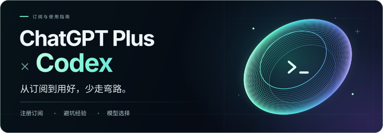
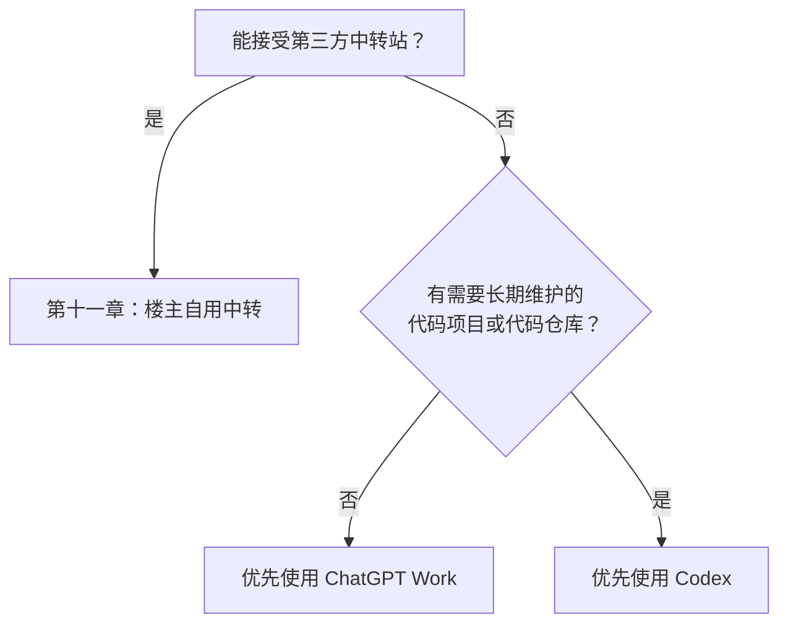

<h1 align="center">ChatGPT Plus 国内订阅与 Codex 使用避坑指南（2026.9.18 更新）</h1>

  

| 账号准备 | 付款订阅 | 使用 Codex | 三档滑块工具 |
| :--- | :--- | :--- | :--- |
| 准备邮箱，注册 ChatGPT 账号 | 准备美区 Apple ID 和礼品卡，开通 Plus | 按任务选择模型与推理强度 | 一次选好常用模型与推理强度 |
| [从注册开始 →](#三注册-gmail) | [付款前必读 →](#五付款前必须知道的事) | [看看模型怎么选 →](#十三codex-模型与推理强度选择) | [查看工具（中文）→](https://github.com/cabbagecabbage/codex-model-slider/blob/main/README.zh-CN.md) |

<strong>觉得有帮助，欢迎点个 Star ⭐ 支持一下！</strong> 有新经验或发现内容需要更新，也欢迎<a href="https://github.com/cabbagecabbage/chatgpt-plus-codex-cn-guide/issues">提 Issue</a>，一起把这份指南补充得更好。

写在前面

写这篇教程，是想记录楼主踩过的坑，帮后来者少走弯路。如果你有更好的方案、实际经验，或发现文中有不确定的地方，欢迎提 Issue，楼主看到会回复，也希望大家一起补充完善。觉得有帮助的话，顺手点个 Star 支持一下～

**看完本文你可以获得什么**

只要具备稳定的海外代理，跟着本文一步步操作，100% 可以掌握注册、订阅并长期稳定使用 ChatGPT Plus 的方法，规避所有楼主踩过的坑。

本文还会结合实际使用场景和额度成本，给出 Codex 模型与推理强度的选择路径。

---

## 一、先确定自己的需求

这篇教程不需要从头读到尾。先回答第一个问题：**你能接受使用第三方中转站吗？**

- 能接受：可以直接看[楼主自用中转](#十一楼主自用中转)。
- 不能接受：继续回答下面的第二个问题，确定自己需要 ChatGPT Work 还是 Codex。

1. 只需要使用 ChatGPT 或 ChatGPT Work：主要进行对话、调研、文档、表格或网页任务。
2. 刚需 Codex：需要让 AI 参与代码开发，修改项目文件、运行测试或处理 Git。

> 如果你是新手，不知道怎么判断，可以简单理解为：**非程序员优先用 Work，程序员优先用 Codex。**
>
> 以上只是方便入门的参考标准。如果你是深度用户，请根据自己的实际需求自行判断。

```mermaid
flowchart TD
    A["能接受第三方中转站？"] -->|是| B["第十一章：楼主自用中转"]
    A -->|否| C{"有需要长期维护的<br/>代码项目或代码仓库？"}
    C -->|否| D["优先使用 ChatGPT Work"]
    C -->|是| E["优先使用 Codex"]
```

ChatGPT Work 和 Codex 的注册、订阅与使用流程基本一致，但 Codex 最好额外准备一个能长期接收短信验证码的海外手机号；如果没有，后文也会介绍替代方案。

---

## 二、章节跳转目录

根据自己的需求，可以直接跳到对应章节：

| 你的需求 | 对应章节 |
|---|---|
| 注册海外邮箱 | [第三章：注册 Gmail](#三注册-gmail) |
| 注册 ChatGPT 账号 | [第四章：注册 ChatGPT 账号](#四注册-chatgpt-账号) |
| 了解付款账号、Codex 验证和退款注意事项 | [第五章：付款前必须知道的事](#五付款前必须知道的事) |
| 注册美区 Apple ID | [第六章：注册美区 Apple ID](#六注册美区-apple-id) |
| 购买美区礼品卡 | [第七章：购买美区 Apple Gift Card](#七购买美区-apple-gift-card) |
| 通过美区 Apple ID 订阅 Plus | [第八章：通过美区 Apple ID 为 ChatGPT 添加订阅](#八通过美区-apple-id-为-chatgpt-添加订阅) |
| Codex 手机号验证与接码 | [第九章：Codex 短信接码](#九codex-短信接码) |
| 使用 CC Switch 切换 Codex 登录状态 | [第十章：使用 CC Switch 切换登录状态，避免反复退出登录](#十使用-cc-switch-切换登录状态避免反复退出登录) |
| 查看楼主使用记录 | [附录：楼主使用记录（持续更新）](#附录楼主使用记录持续更新) |
| 使用楼主自用中转 | [第十一章：楼主自用中转](#十一楼主自用中转) |
| 比较 Codex 周额度和中转站的性价比 | [第十二章：Codex 周额度理论倍率与中转站性价比对比](#十二codex-周额度理论倍率与中转站性价比对比) |
| 选择 Codex 模型、推理强度和升档路线 | [第十三章：Codex 模型与推理强度选择](#十三codex-模型与推理强度选择) |
| 把常用模型与推理强度放进三档滑块（macOS） | [楼主的开源小工具：Codex Model Slider](#把常用组合放进滑块macos) |

---

## 三、注册 Gmail

本章只适用于还没有可长期使用的海外邮箱的用户。

- 已有 ChatGPT 账号：直接看[第五章：付款前必须知道的事](#五付款前必须知道的事)。
- 已有海外邮箱，但还没有 ChatGPT 账号：直接看[第四章：注册 ChatGPT 账号](#四注册-chatgpt-账号)。

Gmail 主要用于注册 ChatGPT 账号；如果你已经有其他可长期使用的海外邮箱，不必重复注册 Gmail。

### 准备什么

- 一个稳定的海外代理环境，确保可以访问 Google 并完成 Gmail 注册。

### 注册 Gmail

1. 打开 [Google 账号注册页面](https://accounts.google.com/signup)。
2. 按页面提示逐步填写信息并完成注册即可。

楼主实测，中国大陆 `+86` 手机号可以完成 Google 页面要求的短信验证。

  

注册还是蛮简单的，没有海外邮箱的话就自己注册个吧～

---

## 四、注册 ChatGPT 账号

本章只适用于还没有 ChatGPT 账号的用户。已有 ChatGPT 账号的用户，可以直接跳到[第五章：付款前必须知道的事](#五付款前必须知道的事)。

### 注册 ChatGPT

1. 打开 [ChatGPT 登录与注册页面](https://chatgpt.com/auth/login)。
2. 选择 **Continue with Google / 使用 Google 继续**。

  

3. 选择准备使用的 Gmail 账号即可。

  

以后登录 ChatGPT、Codex 桌面端、CLI 或 IDE 扩展时，都继续使用相同的登录方式和 Gmail，否则可能进入另一个没有订阅和历史记录的账号。

### 注册需要海外手机号吗？

不需要，新建 OpenAI 账号和普通 ChatGPT 不要求手机号验证。

---

## 五、付款前必须知道的事

付款前，先看清这三点。

### 1. 一个 Apple ID，只能给一个 ChatGPT 账号订阅

> [!CAUTION]
> **首次通过 Apple 内购订阅后，Apple ID 就与本次订阅的 ChatGPT 账号永久绑定。按照目前的政策，永远无法解绑或者换绑。**
>
> 这会导致什么问题？举个例子：
>
> 1. **第一次：** 在手机上，App Store 登录 **美区 ID A**，ChatGPT App 登录**账号 1**。你在 ChatGPT App 中点击订阅并完成 Apple 内购付款，账号 1 获得订阅，美区 ID A 与账号 1 绑定。
> 2. **第二次：** 在手机上，App Store 登录 **美区 ID A**，ChatGPT App 登录**账号 2**。你在 ChatGPT App 中再次点击订阅并付款，以为这次是在给账号 2 充值。
> 3. **实际结果：** 即使付款成功，订阅仍关联到**账号 1**，而不是 ChatGPT App 当前登录的**账号 2**。因为付款用的仍是 美区 ID A，它绑定的还是账号 1。
>
> **换句话说，切换 ChatGPT 登录账号，并不会改变这个 Apple ID 的订阅归属。**
>
> 楼主踩过的坑是：**账号 1 已经删除，再用 美区 ID A 给账号 2 订阅，付款仍关联到已删除的账号 1，账号 2 依然没有订阅。** 删除原账号也没有解除这层绑定，所以第一次付款就要选好准备长期使用的 ChatGPT 账号。

> [!WARNING]
> **如果真的充错了，可以尝试申请退款。** 楼主的经历是：第一次直接获批，没有遇到额外条件；但第二次申请和后续复核都被拒了。**所以不能指望退款来反复兜底，第一次付款就要选对账号。** 具体经过和客服截图见第八章。

### 2. Codex 二次验证

> [!IMPORTANT]
> **触发原因：** 如果你用的是机场 IP 或数据中心 IP，而非纯净家宽，就很有可能被要求手机号验证。
>
> - **首次验证：** 先输入手机号，收到短信后填入验证码，即完成手机号绑定和首次验证。
> - **二次验证：** 以后重新登录时，如果登录 IP 不干净，仍可能要求验证。OpenAI 会向**之前绑定的手机号**发送验证码，填入后才能登录。

> [!CAUTION]
> **手机号一旦绑定，永远无法解绑或换绑。** 一旦触发二次验证，如果收不到原手机号的验证码，就无法登录 Codex。**ChatGPT 网页版和手机端不受影响。**

> [!IMPORTANT]
> 怎么办？按自己的条件看：
>
> 1. **有纯净家宽 IP，并且能确保 100% 纯净、稳定：** 不会被要求手机号验证，一次都不会。但 **95% 以上的人无法保证这一点**。
> 2. **无法保证 IP，但有能稳定接收验证码的国外手机号：** 也可以，后续验证继续用这个号码收短信。**中国手机号不行。**
> 3. **两者都没有：** 只能用接码网站收一次临时验证码，同时祈祷以后不要触发二次验证。具体接码方法见第九章。

> [!WARNING]
> **用临时号码验证后，尽量保持登录状态，不要退出登录。** 退出后重新登录可能触发二次验证；需要切换账号时，用 **CC Switch** 切换，具体方法见第十章。

### 3. 确认你的 Apple 账号是免税区

> [!IMPORTANT]
> **付款前，确认美区 Apple ID 的账单地址在免税州。** 本文的订阅金额均按免税区计算。

---

## 六、注册美区 Apple ID

已有美区 Apple ID？直接跳到[第七章：购买美区 Apple Gift Card](#七购买美区-apple-gift-card)；如果礼品卡也已准备好，直接跳到[第八章：为 ChatGPT 添加订阅](#八通过美区-apple-id-为-chatgpt-添加订阅)。

### 注册美区 Apple ID

美区 Apple ID 的注册教程网上有很多，可以在 Google 搜索“美区 Apple ID 注册教程”，参考搜索结果中的知乎、GitHub 等平台上的经验文章，优先选择发布时间较近、步骤和截图比较完整的教程。一般跟着教程一步步操作，问题不会太大。注册完成后，再继续看下文的美区礼品卡和 Plus 订阅步骤。

---

## 七、购买美区 Apple Gift Card

楼主优先通过支付宝购买美区 Apple Gift Card。

支付宝首页左上角地区选择**旧金山**，然后点击**礼品卡**；跳转后，首屏即可看到 Apple 礼卡入口。

1. 地区选择旧金山，点击“礼品卡”。
2. 跳转后选择 Apple 礼卡。

  
  

> [!WARNING]
> 坑点：每月月初约前 5～7 天，支付宝可能显示正在补货，无法购买礼品卡，此时只能等待补货；急用时可以考虑闲鱼。

---

## 八、通过美区 Apple ID 为 ChatGPT 添加订阅

准备好美区 Apple ID 和礼品卡后，在 ChatGPT App 中完成订阅。

### 订阅步骤

1. 使用准备付款的美区 Apple ID 登录 App Store，下载 OpenAI 官方 ChatGPT App。
2. 在 ChatGPT App 登录准备长期使用的目标账号，核对邮箱和登录方式。
3. 确认 App Store“媒体与购买项目”显示的是准备扣款的 Apple ID。
4. 在 ChatGPT App 打开套餐升级入口，选择 ChatGPT Plus，确认订阅信息后通过 Apple 内购付款。
5. 付款后确认目标 ChatGPT 账号已经显示 Plus。

> [!IMPORTANT]
> **开通 5 倍 Pro、20 倍 Pro 的方法：先订阅 Plus，再升级 5 倍 Pro 或 20 倍 Pro。**
>
> 1. 按上面的步骤，在 ChatGPT App 中通过 Apple 内购订阅 **20 美元/月的 Plus**。
> 2. 打开 **App Store → 右上角头像 → 订阅 → ChatGPT → 查看所有方案**，选择 **100 美元/月的 Pro 5×** 或 **200 美元/月的 Pro 20×**。也可以从 **iPhone 设置 → 你的姓名 → 订阅 → ChatGPT → 查看所有方案**进入。
>
> **余额要够付 Pro 的全额，不能只准备差价。** 以 200 美元方案为例：先扣 20 美元开 Plus，切换 Pro 时，Apple 账户里还要有足够支付 200 美元的余额，然后再扣 200 美元。也就是说，若从零开始、全部用余额付款，退款前需要先准备 **220 美元**；100 美元方案同理，需要先准备 **120 美元**。
>
> **楼主开通 Plus 后立刻切换到 20 倍 Pro，升级后 1～2 天内，完整的 20 美元退回了 Apple 账户余额。** 退款在升级后到账，不会提前抵扣 Pro 的付款。
>
> 目前 200 美元的 Pro 暂停新购和升级，详见 [OpenAI 套餐说明](https://help.openai.com/en/articles/9793128)。

### Apple 余额无法完成购买

> [!WARNING]
> 付款时如果出现 `Your Purchase Could Not Be Completed`，通常说明 Apple Account 触发了购买风控，新注册的账号更容易遇到。不过别急，这个问题可以 100% 稳定解决：

楼主当时参考了这篇[购买失败处理教程](https://zhuanlan.zhihu.com/p/1987246308558403449)，通过 Apple 支持的“无法完成购买”入口联系人工客服核查购买权限。

### 如何退款

如果因为特殊原因需要退款，通过 Apple 内购的订阅可以按下面的步骤申请：

1. 打开 [Apple 退款页面](https://reportaproblem.apple.com/)，登录付款时使用的美区 Apple ID。
2. 在“我需要”中选择“请求退款”，按实际情况选择原因，点击“下一步”。
3. 选中要退款的 ChatGPT 订阅订单，点击“提交”。
4. 提交后可在同一页面查看申请状态；Apple 通常会在 24～48 小时内更新处理结果，退款获批后还需等待款项到账。步骤可参考 [Apple 退款说明](https://support.apple.com/zh-cn/118223)。

> [!CAUTION]
> **退款的机会只有一次。** 楼主第二次申请退款及复核都被拒绝，在线客服也表示没有入口再处理，只能建议联系高级团队，且不能保证退款。**不要指望退款反复兜底。**

#### 楼主的退款经历

楼主先后经历了首次退款获批、再次申请及复核被拒，下面是具体经过和截图。

- 7 月 5 日下午：通过 iOS 开通 Plus。
- 7 月 7 日：Codex 登录触发二次验证，申请退款，首次申请获批，20 美元退回 Apple 余额。
- 随后使用同一 Apple 账号在新 ChatGPT 账号里再次购买，但订阅仍关联到已经注销的旧账号。
- 7 月 14 日：第二次申请退款，被判定为不符合退款条件。
- 7 月 16 日：复核后仍被拒绝，页面显示为最终结果。
- 7 月 17 日：Apple 在线客服表示普通顾问无法继续操作，只能尝试拨打美区支持电话 `1-800-275-2273` 联系高级团队，且不能保证退款；邮件也不能替代这一步。

楼主的 Apple 退款申请记录，可以看到 7 月 7 日的首次退款获批，7 月 14 日、16 日的后续申请被拒。

  

<em>Apple 退款处理记录</em>

下面两张图是楼主与 Apple 客服沟通退款问题的实际记录：

  
  

<em>Apple 客服沟通记录</em>

---

## 九、Codex 短信接码

如果你有 **100% 纯净且长期稳定的家宽 IP**，可跳过本章，直接看[第十章：使用 CC Switch 切换登录状态](#十使用-cc-switch-切换登录状态避免反复退出登录)。

> [!IMPORTANT]
> 刚需 Codex 的用户请重点阅读本章。如果你只使用网页/移动端 ChatGPT 或 ChatGPT Work，不需要桌面端 Codex，可以跳过。

### Codex 登录流程

1. 在桌面端 Codex 中选择使用 ChatGPT 账号登录。
2. Codex 会跳转到网页端登录页面，继续选择 **Continue with Google / 使用 Google 继续**。
3. 选择前面注册 ChatGPT 时使用的 Gmail 账号。
4. 首次登录时，按页面提示绑定手机号并完成短信验证。

如果你能接受以后可能触发二次验证、临时号码无法找回的风险，也可以通过临时接码网站完成首次验证。楼主使用的是 [Hero SMS](https://hero-sms.com/cn)：首次需要充值约 2 美元，每次接码成本约 0.5 元人民币；选个热门地区号码即可。

> [!WARNING]
> 临时号码有效时间是 20 分钟，后续无法找回，二验就寄。

> [!CAUTION]
> 目前二次验证没有任何跳过方式：一旦触发二次验证，而你又无法接收短信验证码，就无法登录桌面端 Codex。此时只能选择：1. 向 OpenAI 申诉 2. 寄希望于风控策略放宽 3. 换纯净 IP 4. 注销账号，等待邮箱一个月后解除占用，再重新注册账号并绑定新的手机号。

### 二次验证与申诉

可以尝试向 OpenAI 申诉。无法保证一定能解除验证。

1. 通过 [OpenAI Help Center](https://help.openai.com/) 右下角聊天入口联系支持。
2. 与英文客服沟通时，可以使用 ChatGPT 极速模式翻译对方回复并生成英文答复。

#### 楼主的申诉经历

2026 年 7 月 14 日，楼主就触发二次验证、无法接收验证码登录桌面端 Codex 的问题向 OpenAI 客服提交申诉。

  

<em>7 月 14 日：向 OpenAI 客服提交申诉</em>

7 月 18 日，OpenAI 客服回复：目前不支持更改、更新或替换账号关联的手机号，客服也无法手动修改手机号验证记录；如需使用其他手机号，只能创建新账号。

  

<em>7 月 18 日：OpenAI 客服回复</em>

同日，楼主再次尝试登录 Codex，神奇地发现不需要二次验证了，可以正常进入。目前无法确认是申诉生效、账号风控解除，还是整体验证策略有所放宽。

截至 7 月 27 日，楼主共有 3 个通过上述途径注册并开通 Plus 的账号，目前都在稳定使用。7 月 18 日之后，暂未再次出现登录状态失效或触发二次验证的问题。以上只是楼主当前的实际使用情况，不代表后续一定不会再次触发验证。

---

## 十、使用 CC Switch 切换登录状态，避免反复退出登录

如果需要频繁切换账号，建议使用 [CC Switch](https://github.com/farion1231/cc-switch) 切换登录状态，避免因反复退出和重新登录而触发二次验证。

> [!WARNING]
> 坑点：建议每天通过 CC Switch 切换并登录一次 Codex。长时间不登录，保存的登录状态可能失效，之后仍需重新登录，登录就有可能会触发二次验证。

---

## 十一、楼主自用中转

目前楼主采用 **20 倍 Pro 主力、中转兜底**的方式：优先使用 20 倍 Pro，额度用完后再切换到中转。这篇教程主要是把自己的心路历程和踩坑经验记录下来，分享给有订阅需求的朋友，帮大家少走一些弯路。

目前楼主使用的中转是 [zz-api.cc.cd](https://ww.zz-api.cc.cd/register?aff=TGTMUXRZFVTR)。本文也对中转的整体性价比进行了分析，详见[第十二章：Codex 周额度理论倍率与中转站性价比对比](#十二codex-周额度理论倍率与中转站性价比对比)。

如果你准备试用下楼主使用的中转，可以通过[楼主的邀请链接](https://ww.zz-api.cc.cd/register?aff=TGTMUXRZFVTR)注册。通过该链接注册后，楼主可以获得 `10%` 的返利，就当支持楼主了hhhh~

## 十二、Codex 周额度理论倍率与中转站性价比对比

本章只保留结论，完整的统计口径、7 月推导、成本表和 1～15 倍换算表见[《Codex 周额度理论倍率、临界倍率与中转站性价比对比：详细计算》](docs/plus-relay-cost-analysis.md)。

### 先看结论

| 用户类型 | 判断标准 | 建议 |
|---|---|---|
| **重度用户** | 需要一个以上的 Plus 容量，能用满 | `0.10` 及以下的中转倍率都有性价比；超过 `0.10` 后，不如自己充 Plus。 |
| **轻度用户** | 一个 Plus 够用，经常用不完 | 先估算自己需要几倍周额度，再查表；例如你 4 倍就够用，`0.23` 及以下都有性价比 |
| **超级重度用户** | 需要 10 个 Plus 以上的容量 | `0.05` 及以下；建议直接上 20x Pro，中转很难做到这个价格 |

> [!WARNING]
> **你真的有这么大用量吗？**
>
> 模型和推理强度会影响额度消耗，也要结合完成任务的速度来选择。此前按 Luna 降价后的口径估算，Luna Max 在所选 9 项评测中的总成本比 Sol Medium 低约 83%。楼主目前按任务选择 Luna Max、Sol High 或 Astra Medium，见[第十三章：Codex 模型与推理强度选择](#十三codex-模型与推理强度选择)。

---

## 十三、Codex 模型与推理强度选择

楼主目前的选择：

- **Luna Max**：简单任务，省额度。
- **Sol High**：需求明确、有测试和验收的工程开发。
- **Astra Medium**：方案、机制、架构和 Skill 设计。

按任务直接选，不用逐级尝试。详细理由和评测见[模型与推理强度选择分析](docs/model-selection-and-reasoning.md)。

### 把常用组合放进滑块（macOS）

楼主的开源工具 **[Codex Model Slider（中文说明）](https://github.com/cabbagecabbage/codex-model-slider/blob/main/README.zh-CN.md)**，把滑块改成 **Luna Max → Sol High → Astra Medium**，拖一下就能同时切换模型与推理强度。

**一行安装到桌面，以后双击启动。** [查看安装命令和使用说明 →](https://github.com/cabbagecabbage/codex-model-slider/blob/main/README.zh-CN.md#快速使用)

觉得有用，欢迎到[项目页面](https://github.com/cabbagecabbage/codex-model-slider)点个 **Star ⭐**！

---

## 附录：楼主使用记录（持续更新）

本附录记录楼主使用官方 Plus 和第三方中转的实际情况，包括额度重置、使用感受、线路价格和切换原因。内容基于楼主个人使用情况，实际体验可能因账号、用量和线路波动而不同。

### 2026 年 9 月 13 日

最近常用的档位调整为 Luna Max、Sol High 和 Astra Medium：简单需求用 Luna 节省额度，有测试和验收机制的工程开发优先用 Sol，方案、机制、架构和 Skill 设计更倾向于直接用 Astra。体感上 Astra 完成任务最快、也更容易抓住重点，但额度消耗更快；少量需要人参与思考的设计讨论，楼主愿意为更好的判断力花这部分额度。以上是个人使用感受，详细说明见[第十三章](#十三codex-模型与推理强度选择)。

### 2026 年 8 月 6 日

楼主已经连续使用 Luna Max 一周。和 Sol Medium 相比，实际使用时效果上几乎感受不到差异；体感上额度消耗速度可能降低了 80%，日常可以一直开 Fast 使用，性价比实在太高了。强烈推荐大家亲自切到 Luna Max 用一段时间。

最近楼主使用中转也少了，目前主要还是使用官方 Plus。一方面，最近没有再遇到 Codex 登录掉线或触发二次验证；另一方面，部分中转站不提供 Luna，而 Terra 和 Sol 相较 Luna 成本高出很多，效果提升却并不明显。因此，不支持 Luna 的中转一律不推荐。另一个问题是，中转似乎也不支持 Fast（这倒也不一定算问题，因为 Fast 本质上是额外消耗额度换速度：速度提升 `1.5` 倍，额度消耗 `2.5` 倍）。最近两天，楼主使用的这个中转上的 Luna 也不太好用，后续继续观察。

### 2026 年 8 月 1 日

7 月整个月，Codex 官方一共提前重置了 12 次；8 月 1 日今天又提前重置 1 次。本文按每月实际重置时间线统计已经享有的周额度，再据此计算倍率。

### 2026 年 7 月 27 日

本周楼主主要使用官方 Plus。中转线路倍率不太稳定，基本在 `0.07～0.1` 之间波动。楼主每次都能在额度刷新前稳定用完周额度，而这个月截至当时已经额外重置 10 次。7 月最终的有效额度和成本，按第十二章的实际时间线算法计算。目前中转主要用于 Plus 额度用完后的兜底。

不过，楼主的使用情况不一定适用于所有人。如果你的 Token 用量较少、无法用完 Plus 额度，中转可能仍然更划算。建议参考[第十二章：Codex 周额度理论倍率与中转站性价比对比](#十二codex-周额度理论倍率与中转站性价比对比)，按照自己的实际用量估算后再决定。

### 2026 年 7 月 22 日

昨晚用 `0.08` 倍率线路跑了一宿任务，跑了将近 5 亿 Token，花了楼主 30 多块钱。早上起来才发现，昨晚降价了，有 `0.03` 倍率可用，血亏 20 多😭😭😭，赶紧切过去了。切换后使用暂时稳定，结果刚刚再看，`0.03` 倍率组又涨到了 `0.06`，价格变动也太快了，继续观察。

  

### 2026 年 7 月 21 日

今天 `0.05` 倍率线路不稳定，楼主使用时出现断联；切换到 `0.08` 倍率线路后恢复正常，后续再观察一下。
