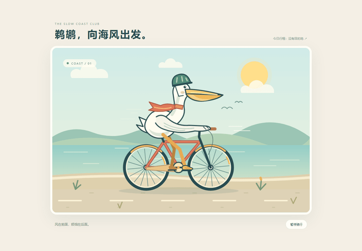
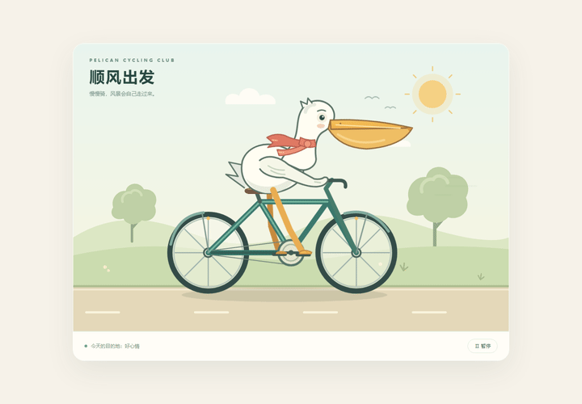
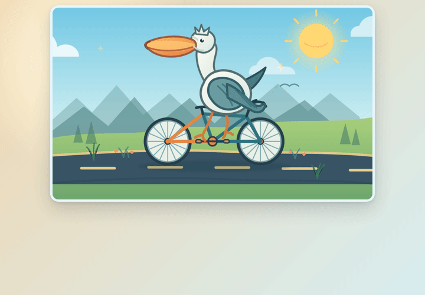

# Codex 降智：快速自测与解决方案

> 更新时间：2026 年 10 月 1 日

## 一、什么是降智

降智是指你选择的 Astra、Sol 等大模型被替换成 Luna、GPT-5.5 mini 等小模型。

## 二、降智的原因

IP 频繁变动或纯净度不高（例如使用机场 IP）、订阅重新分发（例如使用 sub2api），以及其他违反 OpenAI 用户使用协议的行为被检测到后，会触发降智。

## 三、如何检测降智

推荐用鹈鹕测试快速检测降智，主要看模型的代码生成能力。

```text
创建一个 HTML，用 SVG 绘制鹈鹕骑自行车的 2D 动画。
不要参考任何其他文件。你不需要进行任何测试。
```

| GPT-6 Astra / medium | GPT-6.1 Sol / high | GPT-5.6 Luna / max |
| --- | --- | --- |
|  |  |  |

如果你选择的是 Astra、Sol，生成效果和前两张图差不多，那么恭喜你，你没有被降智；如果生成效果和最后一张图差不多，那么也要恭喜你，你已经发现自己被降智了。

## 四、降智后如何恢复

楼主曾因账号降智与 OpenAI 客服沟通过，客服反馈，降智是一个动态检测过程。

恢复思路是：先停止所有违反 OpenAI 用户使用协议的行为，将账号静置一段时间，等待系统重新评估、恢复正常。

楼主的 20 倍 Pro 账号按这个方法处理，静置三天后恢复正常。
