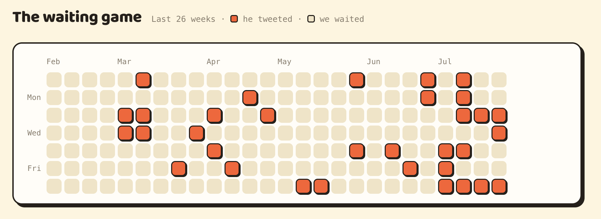

# Codex 周额度理论倍率、临界倍率与中转站性价比对比

> 更新时间：2026 年 8 月 1 日
> 适用前提：能够把官方 Plus 的周额度基本用满。额度用不完时，应按实际用量重新计算。

[返回 README 第十章：Codex 周额度理论倍率与中转站性价比对比](../README.md#十codex-周额度理论倍率与中转站性价比对比)

## 先看结论

本文优先使用历史平均值判断长期性价比，而不是直接套用某一个特别高或特别低的月份。下面依次说明：历史平均、7 月单月、8 月当前进度，以及如何按照自己的实际需求查表。

## 一、历史平均：最有代表性的长期口径

### 连续统计方法

历史平均不按每个月月初重新切断，而是从选定的起点开始连续追踪：

- 从 2026 年 3 月 1 日 `00:00` 作为第一次自然重置开始；
- 下一次自然重置按上一次重置之后 7 天计算；
- 如果 7 天到来前出现官方提前重置，就计入这次提前重置，并把下一次自然重置顺延到它之后 7 天；
- 一直统计到 2026 年 7 月 31 日结束，不在 6 月 1 日、7 月 1 日再次人为补一次自然重置。

截图中的日期按人工方式核对，不把这套统计展开成复杂公式。

### 2026 年 3 月 1 日至 7 月 31 日：45 倍周额度

根据 [Codex Resets](https://codex-resets.com/) 的记录，按上述连续口径人工核对：

从 2026 年 3 月 1 日到 7 月 31 日，连续统计享有 **45 倍周额度**。这不是把每个月分别重新计算后相加，而是沿着同一条重置时间线连续统计。

| 月份 | 连续时间线中该月发生的重置时间点（自然 + 官方提前） |
|---|---:|
| 2026 年 3 月 | **9 倍** |
| 2026 年 4 月 | **8 倍** |
| 2026 年 5 月 | **7 倍** |
| 2026 年 6 月 | **8 倍** |
| 2026 年 7 月 | **13 倍** |
| **合计** | **45 倍** |

> 这里仅统计连续时间线落在各月份的重置时间点，包括自然重置和官方提前重置；不是每月重新起算。

<p align="center">
  
</p>

<p align="center"><em>Codex Resets 记录的 2026 年 3 月至 7 月额度重置情况</em></p>

按 3～7 月共 5 个月折算，平均每月：

```text
45 ÷ 5 = 9 倍周额度
9 × 150 美元 = 1,350 美元 API 等值用量
```

### 按历史平均值计算 Plus 临界倍率

Plus 月费按 `140 元人民币`计算，历史平均每月约有 `1,350 美元 API 等值用量`：

```text
140 元 ÷ 1,350 美元
≈ 0.1037 元/美元
```

因此，按历史平均值判断，`0.1037` 左右是官方 Plus 与中转的临界点。额度能够基本用满时，中转倍率低于这个数更划算；用量不足时，应按实际用量重新计算。

## 二、2026 年 7 月单月案例：14 倍周额度

7 月是一次官方提前重置非常密集的特殊月份。这里单独按 7 月 1 日 `00:00` 重新起算，用来展示单月高峰情况；它不替代上面的历史平均口径。

根据 [Codex Resets](https://codex-resets.com/) 的记录，7 月 Codex 官方提前重置了 12 次：

| 时间段或事件 | 计入额度 |
|---|---:|
| 7 月 1 日 `00:00` ～ 7 月 8 日 `00:00` | 1 倍 |
| 7 月 8 日 `00:00` ～ 7 月 9 日第一次官方提前重置前 | 1 倍 |
| 7 月内 12 次官方提前重置 | 12 倍 |
| **合计** | **14 倍** |

<p align="center">
  
</p>

<p align="center"><em>Codex Resets 记录的 2026 年 7 月额度重置情况</em></p>

Plus 周额度按 `150 美元 API 等值用量`估算：

```text
14 × 150 美元 = 2,100 美元 API 等值用量
```

Plus 月费按 `140 元人民币`计算：

```text
140 元 ÷ 2,100 美元
≈ 0.0667 元/美元
```

| 中转倍率 | 购买 2,100 美元等值用量的成本 | 结论 |
|---:|---:|---|
| `0.03` | 63 元 | 中转更划算 |
| `0.06` | 126 元 | 中转更划算 |
| `0.0667` | 约 140 元 | 临界点 |
| `0.07` | 147 元 | Plus 更划算 |
| `0.08` | 168 元 | Plus 更划算 |

## 三、2026 年 8 月当前进度

8 月还没有结束，不能把当前进度当成整月最终结果，也不能拿它直接替代历史平均。

截至 2026 年 8 月 1 日，8 月已经实际享有 2 倍周额度。即使后续不再发生官方提前重置，按当前月度口径，8 月整月至少也会有 6 倍；最终结果要等月底完整记录确认。

## 四、按自己的实际需求查表

先估算自己实际需要多少倍周额度，再查下面的换算表：

```text
Plus 临界倍率 = 140 ÷ (实际周额度倍数 × 150)
20x Pro 理论临界倍率 = Plus 临界倍率 ÷ 2
```

> 说明：完整自然月正常至少有 4 倍周额度；1～3 倍主要用于低用量用户根据自己的实际需求查表。

| 实际周额度倍数 | API 等值额度（美元） | Plus 临界倍率 | 20x Pro 理论临界倍率 |
|---:|---:|---:|---:|
| 1 | 150 | `0.9333` | `0.4667` |
| 2 | 300 | `0.4667` | `0.2333` |
| 3 | 450 | `0.3111` | `0.1556` |
| 4 | 600 | `0.2333` | `0.1167` |
| 5 | 750 | `0.1867` | `0.0933` |
| 6（2026 年 8 月至少） | 900 | `0.1556` | `0.0778` |
| 7 | 1,050 | `0.1333` | `0.0667` |
| 8 | 1,200 | `0.1167` | `0.0583` |
| 9（2026 年 3～7 月连续平均） | 1,350 | `0.1037` | `0.0519` |
| 10 | 1,500 | `0.0933` | `0.0467` |
| 11 | 1,650 | `0.0848` | `0.0424` |
| 12 | 1,800 | `0.0778` | `0.0389` |
| 13 | 1,950 | `0.0718` | `0.0359` |
| 14（2026 年 7 月实际） | 2,100 | `0.0667` | `0.0333` |
| 15 | 2,250 | `0.0622` | `0.0311` |

## 五、20x Pro 理论参考

按“月费是 Plus 的 10 倍、周额度是 20 倍”的理论口径，20x Pro 的临界倍率正好是 Plus 的一半：

- 按 3～7 月平均 9 倍周额度计算，理论临界倍率约为 `0.0519` 元/美元；
- 按 7 月实际 14 倍周额度计算，理论临界倍率约为 `0.0333` 元/美元。

但 Pro 更难在每次重置前把额度用满。若实际用量不足，应按“月费 ÷ 实际用量”重新计算，真实临界倍率会高于表中的理论值。
